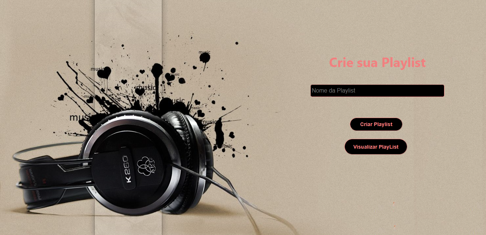
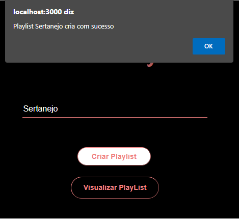
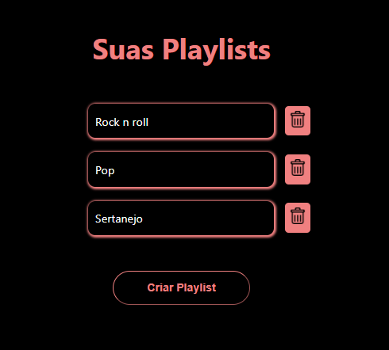
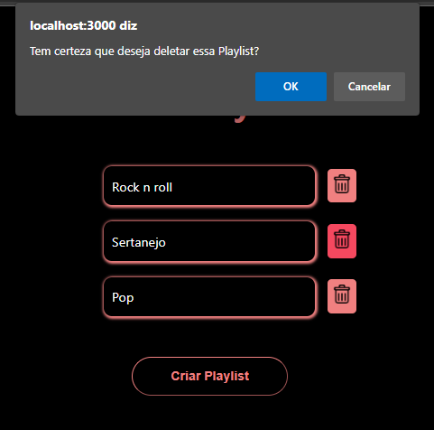
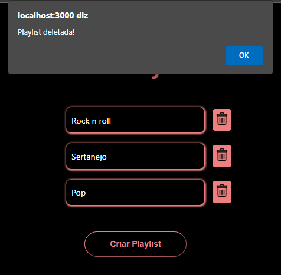
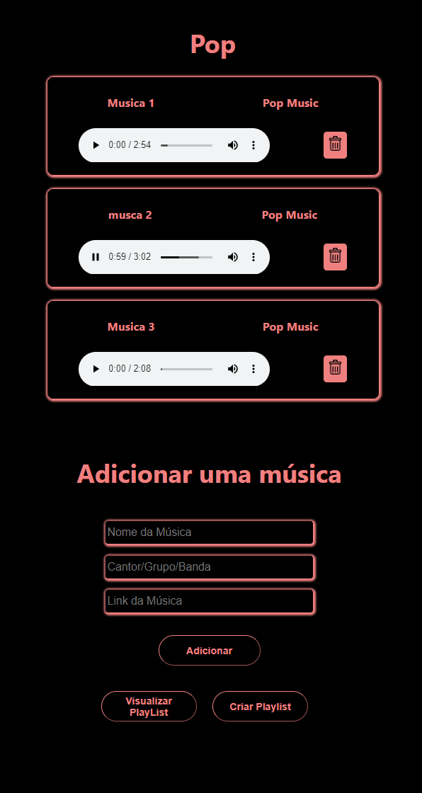

<h1 align="center">
     
    
🚀 Projeto Labefy

</h1>

 

 O projeto hoje será integrado com API labefy onde podemos fazer uma playlist, adicionar musicas, listar as músicas e ouvi-las. 

<h1>
     
    
🧠 Contexto

</h1>

O objetivo foi criar um aplicativo para mostar novas mensagens.

- Layout
- Link do projeto do Surge
- Tecnologias Utilizadas
- Requisitos
- O que esta funcionando
- O que não está funcionando
- Saudações da Eli!

 

<h1>
     
    
🎨 Layout

</h1>

## Mobile

        

     
     
     

     

     
     

        

---

<h1>
     
    
🔗 Link do projeto no Surge

</h1>

https://pretty-lizards.surge.sh/

 

<h1>
     
    
🛠️ Tecnologias Utilizadas

</h1>

 
 
 
  
  
  
  
 

 

<h1>
     
    
⚙️ Requisitos

</h1>

Para este projeto, só passaremos as funcionalidades e os requisitos que vocês tem que implementar. Portanto, não temos um layout específico para isto. A ideia é treinar não só a criatividade de vocês, mas também a capacidade de **transformar** um **problema comum** em um **problema de programação**.

As funcionalidades do projeto estão listadas abaixo. Colocamos na ordem de prioridade que vocês devem seguir. Ou seja, só façam a próxima funcionalidade se a anterior já estiver 100% concluída.

- O usuário deve ser capaz de criar uma playlist de músicas. Para isso, ele só precisa passar um nome. Não podem existir playlists com o mesmo nome.
- Deve haver a possibilidade do usuário visualizar todas as suas playlists, em uma lista específica. Nesta lista, o usuário também pode deletar alguma playlist.
- O usuário deve ser capaz de visualizar os detalhes de uma playlist: o seu nome e as músicas que fazem parte dela.
- Para adicionar músicas à playlist, o usuário deve informar: o nome, os artistas relacionados (que pode ser só um cantor ou uma banda) e um link com o arquivo de áudio correspondente a esta música
  - **ATENÇÃO!**
    - Subimos algumas músicas neste site (igual fizemos com os vídeos do FutureTube):
      - [http://spoti4.future4.com.br/1.mp3](http://spoti4.future4.com.br/1.mp3) → Vocês podem escolher entre 100 músicas que separamos, só ir trocando o nome do arquivo na URL.
      - Caso queiram procurar arquivos de áudio pela internet, fiquem a vontade.
- Por fim, quando o usuário abrir o detalhe da playlist, ele deve ser capaz de ouvir a cada uma das músicas que estiverem inseridas na playlist. Um botão de 'play' e 'pause' é essencial para isto.

   

<h1>
     
    
✔️ O que funciona

</h1>

- Criar e excluir playlist
- Detalhes da playlist
- Ver e escutar as musicas dentro de cada playlist
- Adicionar e remover musicas na playlist

<h1>
     
    
	❌ O que não funciona

</h1>

- Sem bugs conhecidos
- Não realizei o desafio

<h1>
     
    
👋 Saudações, Eli!

</h1>

_Qualquer dúvida ou sugestão, chama no contatinho!_ [LinkedIn](https://www.linkedin.com/in/elisabete-a-santos/)

 

 

### Feito com 💕 e muita dedicação
