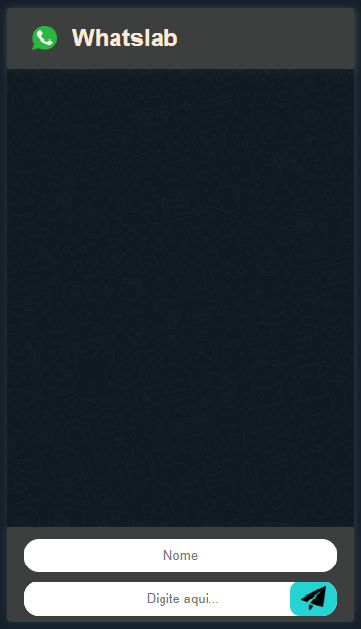
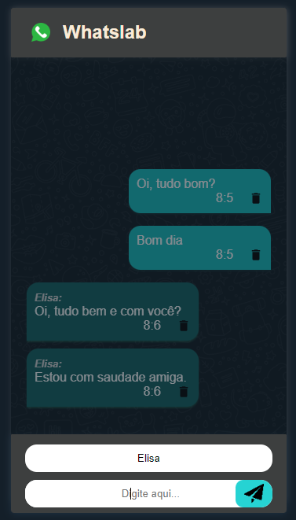
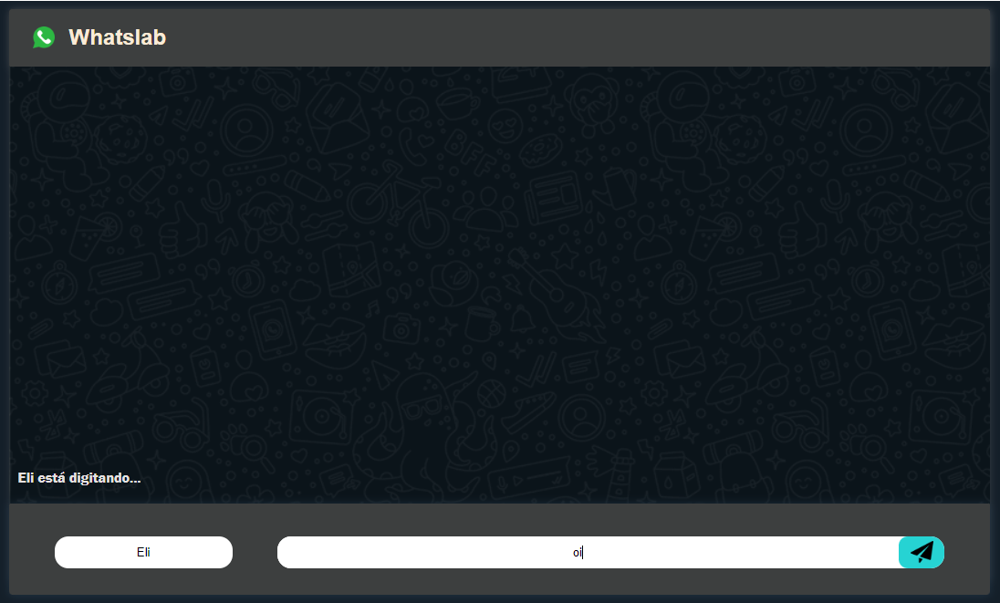
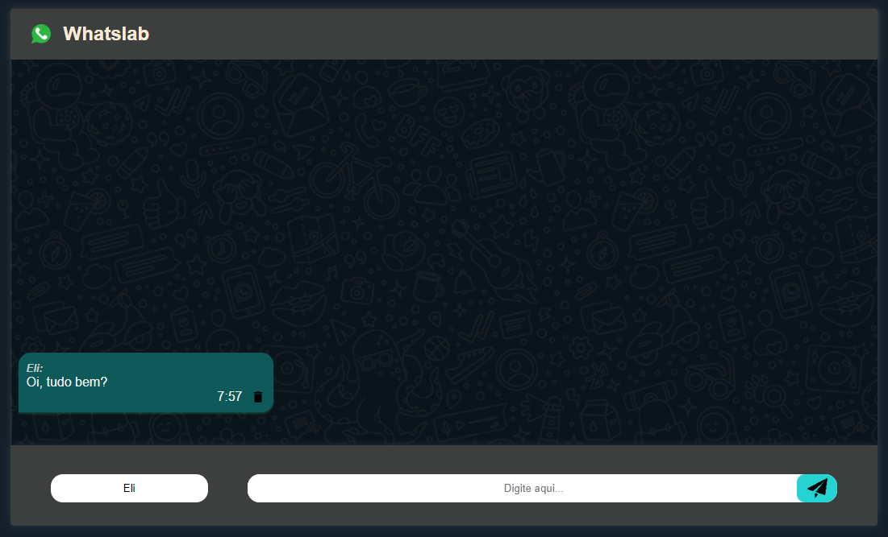
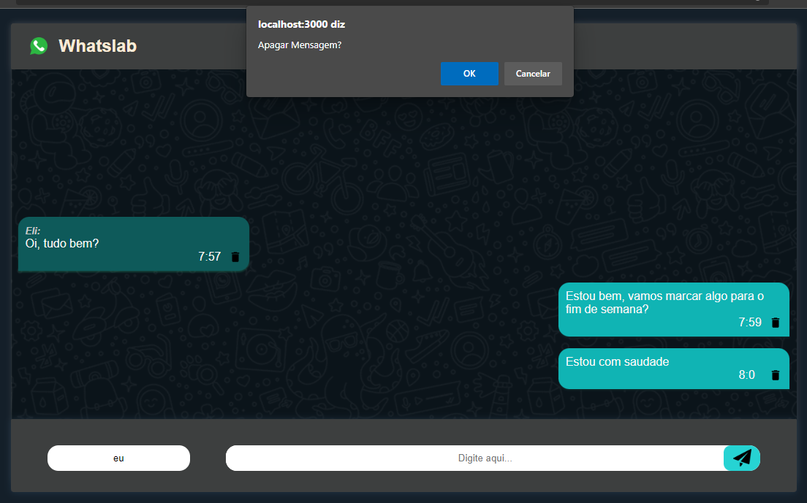

<h1 align="center">
     
    
🚀 Projeto WhatsLab

</h1>

 

 O projeto hoje está tentando fazer uma utopia (: criar um aplicativo de troca de mensagens para bater de frente com os gigantes que existem atualmente, tais como WhatsApp, Telegram, Messenger e muitos outros. 

 

⚠️Um projeto tão grande como este, normalmente, começa com a elaboração de um MVP. MVP significa "Minimum Valiable Product", em tradução livre, "mínimo produto viável". Isto significa que começaremos implementando as features (funcionalidades) que indiquem o objetivo principal do produto do nosso cliente. Desta forma, não há a necessidade de se desenvolver um sistema que envie e receba mensagens de fora - criaremos algo que simplesmente mostra novas mensagens.

 

<h1>
     
    
🧠 Contexto

</h1>

O objetivo foi criar um aplicativo para mostar novas mensagens.

- Layout Mobile e Desktop
- Link do projeto do Surge
- Tecnologias Utilizadas
- Requisitos
- O que esta funcionando
- O que não está funcionando
- Saudações da Eli!

 

<h1>
     
    
🎨 Layout

</h1>

## Mobile

     
     
    

---

## Web

     
     

     
     

---

<h1>
     
    
🔗 Link do projeto no Surge

</h1>

https://cowardly-wing.surge.sh/

 

<h1>
     
    
🛠️ Tecnologias Utilizadas

</h1>

 
 
 
  
  
  
  
 

 

<h1>
     
    
⚙️ Requisitos

</h1>

O escopo deste _MVP é:_

1. **Lista de mensagem:**

   - Cada mensagem deve possuir um remetente (ou seja, um usuário que enviou) e o conteúdo em si.
   - No layout, eles devem ficar assim:

     - nome do remetente: conteúdo

2. **Envio de mensagem:**
   - Abaixo da lista citada, deve existir um local onde o usuário escolhe o nome do remetente (input) ; o conteúdo da mensagem (input) e um botão de enviar;
   - No layout, eles devem ficar um ao lado do outro. Sendo o campo do remetente com largura muito menor do que o campo do conteúdo;
   - Ao enviar a mensagem, os campos devem ser resetados para ficar em branco novamente

- 🏅 **Desafios**

      1. Faça com que tanto o botão de enviar, como o botão "enter" envie as mensagens
      2. Implemente a funcionalidade de deletar mensagem. Sempre que o usuário clicar duas vezes em cima de uma mensagem ela deve ser apagada.
          - 💡  Dica
              - Crie um próprio componente para mostrar a mensagem e o botão de deletar

      3. Agora, vamos melhorar o design do nosso projeto. Queremos deixar mais evidente qual usuário está mandando a mensagem. Para isso, pensamos em mudar um pouco a disposição das mensagens. Sempre que o nome do usuário for "eu", a mensagem deve aparecer à direita e sem mostrar o nome dele; se for outro nome, deve aparecer à esquerda, e deve mostrar o nome do remetente. (Obs.: é uma funcionalidade bem parecida com os grupos do Whatsapp). Tentem seguir o layout do exemplo como guia.

   

<h1>
     
    
✔️ O que funciona

</h1>

- Enviar com enter
- Bolhas estilizadas
- Excluir mensagem com botão
- Excluir mensagem com clique duplo
- Bloqueio para envio de mensagem vazia ou anônima
- Feedback de "usuário está digitando"
- Persistência do ultimo nome
- Conversação: bolhas diferentes para quando o usuário for diferente de "Eu"
- Bolha contém o horário de envio da mensagem
- Responsividade

<h1>
     
    
	❌ O que não funciona

</h1>

- Sem bugs conhecidos

<h1>
     
    
👋 Saudações, Eli!

</h1>

_Qualquer dúvida ou sugestão, chama no contatinho!_ [LinkedIn](https://www.linkedin.com/in/elisabete-a-santos/)

 

 

### Feito com 💕 e muita dedicação

<h1>
     
    
📝 Licença

</h1>

Este projeto esta sob a licença [MIT](./LICENSE).
