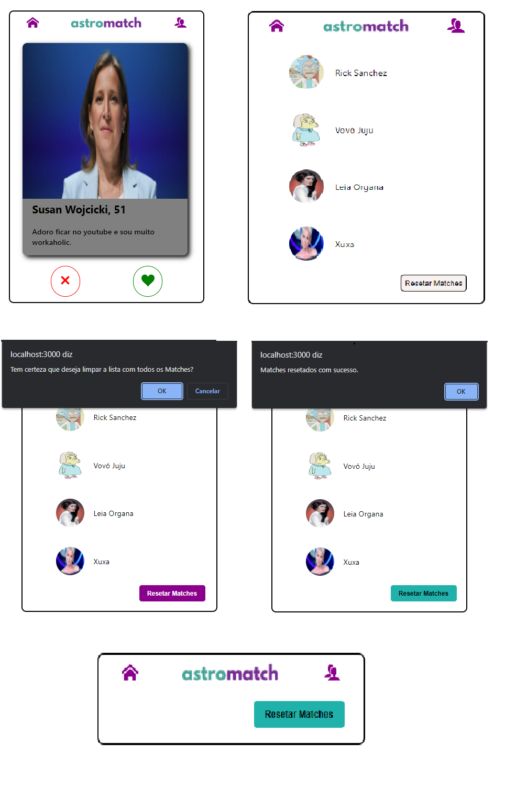
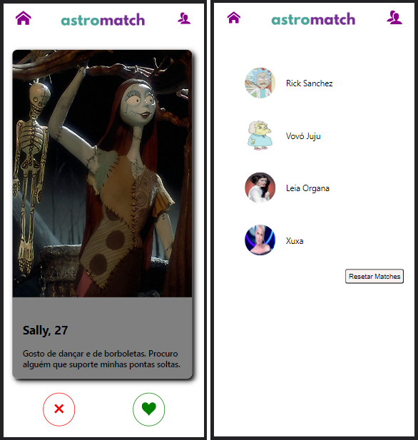

<h1 align="center">
     
    
🚀 Projeto Astromatch

</h1>

O  Astrodev deixou de legado para vocês um projeto com o objetivo de fazer um clone do Tinder: o Astromatch. 
Vamos pedir para que você implemente o projeto, tentando usar ao máximo os conhecimentos adquiridos durante essa semana, a saber: Hooks (*useState e/ou* *useEffect)*

 

<h1>
     
    
🧠 Contexto

</h1>

O objetivo foi criar uma landing Page de uma empresa de tênis voltado para o conforto de quem trabalha em escritório.

- Link do projeto do SURGE
- Layout
- Tecnologias Utilizadas
- Requisitos
- O que funcina e não funciona
- Colaborador!

 

 

<h1>
     
    
🔗 Link do projeto no Surge

</h1>

https://clammy-beef.surge.sh/

 

## 🎨 Layout

 

### 🖥️ Desktop

 

### 📱 Mobile

 

<h1>
     
    
🛠️ Tecnologias Utilizadas

</h1>

 
 
 
  
  
  
  
 

 

<h1>
     
    
⚙️ Requisitos

</h1>

Leia atentamente as especificações:

1. Tela inicial
   Ao entrar na nossa aplicação, o usuário deve ser capaz de ver uma opção de perfil para escolher. Devem ser mostrados a foto, o nome e a descrição dos perfis. Dois botões devem estar na tela: um que permita "dar _match_" (uma escolha "positiva") e o outro que permita descartar a sugestão (uma escolha "negativa"). Por fim, deve existir um botão que leve para a tela de matches.

- Nessa tela, você vai usar os endpoints: _Get profile to choose_ (pegar perfil para escolher) e _Choose Person_ (escolher pessoa)

   

2. Tela de matches
   Essa tela é constituída de uma lista de usuários que "deram _match_" com o usuário que estiver usando a nossa aplicação. Devem ser mostradass as fotos e os nomes dos perfis.

- Nessa tela, você vai usar o endpoint: _Get Matches_ (pegar matches)

   

3. Possibilidade de Resetar
   O usuário da nossa aplicação pode limpar as informações dos matches que deram a qualquer momento em qualquer tela do site. Para isso, adicione um botão que fique bem claro que faz isso (com uma mensagem ou um ícone pertinente)

- Nessa tela, você vai usar o endpoint: _Clear (limpar)_

 

<h1>
     
    
✔️ O que funciona

</h1>

- Opção de curtir ou não curtir a pessoa
- Tela secundaria com os matches
- Botão de resetar todos os matches
- Botão para voltar a tela principal ou ir para tela de matches

 

<h1>
     
    
❌ O que não funciona

</h1>

- Quando o projeto abre ele pula a primeira foto.

<h1>
     
    
👨‍💻 Contribuidor

</h1>

_Qualquer dúvida ou sugestão, chama no contatinho!_

<table>
  <tr>
     <td align="center"><a href="https://github.com/elisabetealves"> <b>Elisabete Alves</b></a> <a target="_blank" href="https://www.linkedin.com/mwlite/in/elisabete-alves-675637135">LinkedIn</a> </td>       
  </tr>
  
</table>

 

### Feito com ❤️ e muita dedicação
