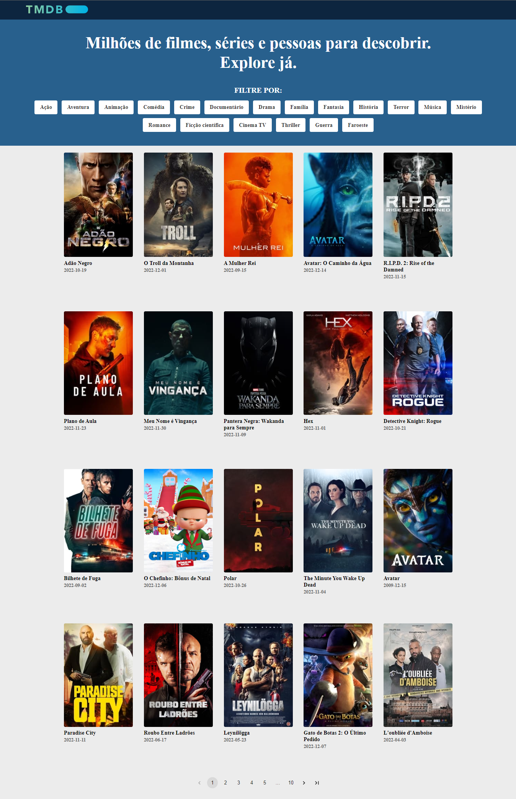
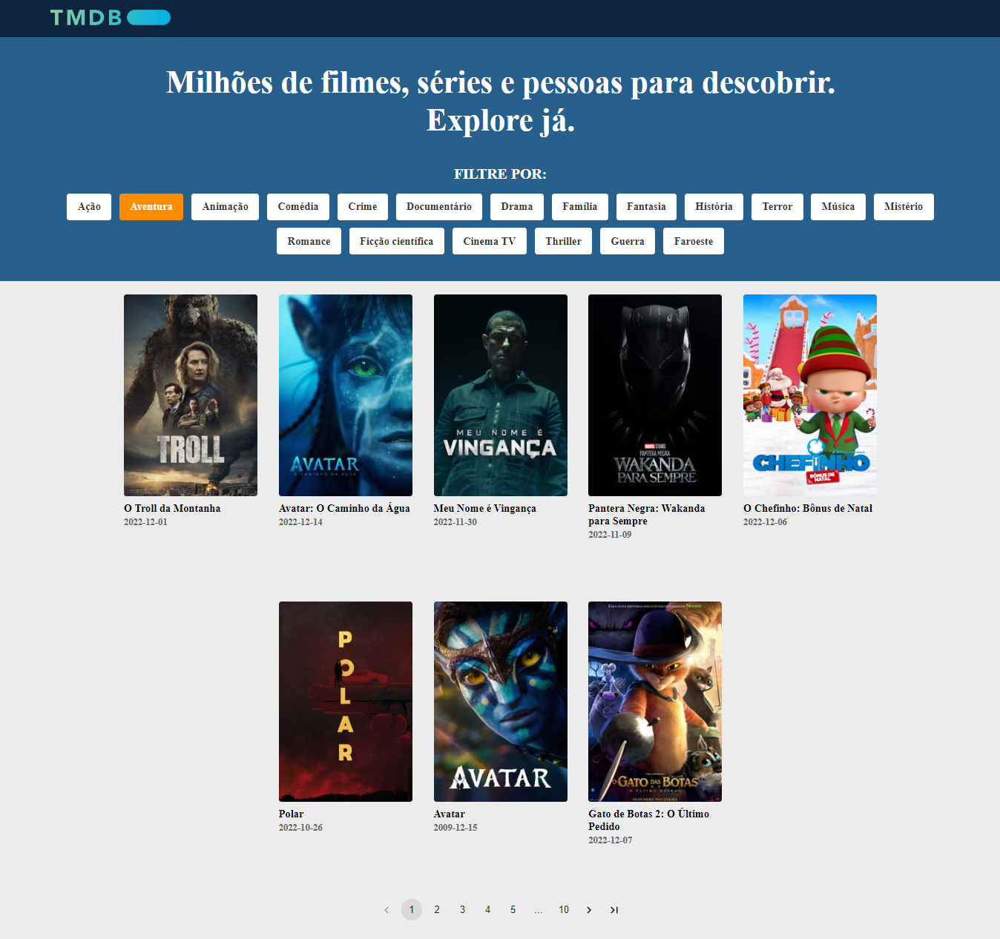
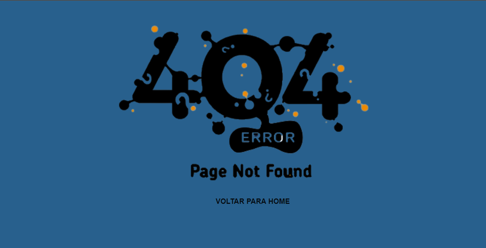
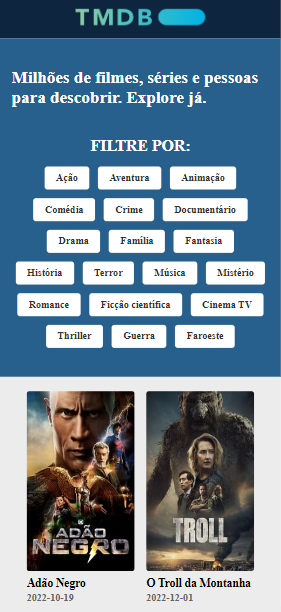
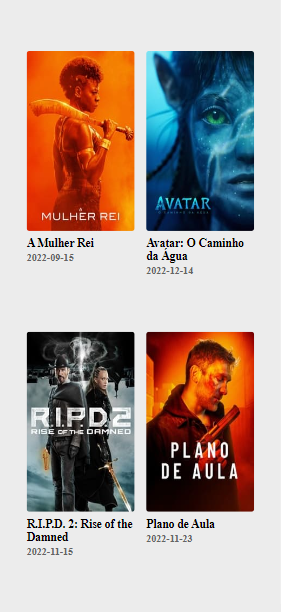
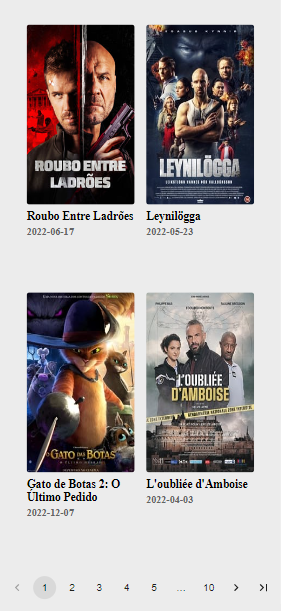
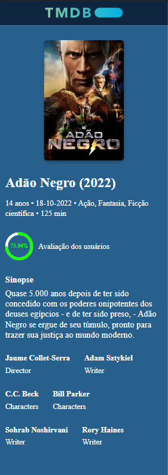
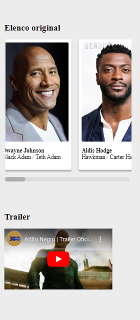
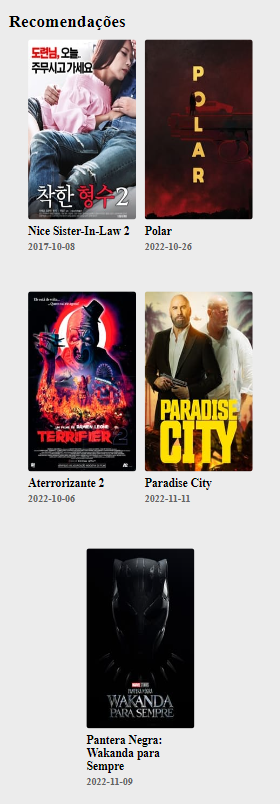

<!--  Animaão -->

   

<h1>
     
    
🧠 Contexto

</h1>

O objetivo foi criar um aplicativo para mostar novas mensagens.

- 🎯 Objetivo do Projeto
- ✍️ Designer
- ⚙️ Requisitos
- ✨ O que Funciona
- ❌ O Que Não Funciona
- 🔗 Link do Projeto no Surge
- 💻 Como rodar o projeto
- 🎨 Layout
- 🛠️ Tecnologias Utilizadas
- 📚 Bibliotecas Utilizadas
- 👨‍💻 Desenvolvedores

<h1>
     
    
🎯 Objetivo do projeto

</h1>
   

A ideia é usar a Poke Api como fonte de dados para o projeto. Ela é uma API pública, bastante utilizada como fonte de dados para aplicações focadas em aprendizado de programação. Assim o objetivo é criar um site sobre Pokémon com o intuito de aplicar os conhcemintos adquiridos ao longo da décima primeira semana do bootcamp de desenvolvimento web fullstack da Labenu. O foco principal desse projeto foi aplicar os conhecimentos sobre: Estado Global, React Context, Providers e Consumers, Hook useContext, Organização dos dados e do componente de Estado Global. Consequentemente contribuiu para fixar conhcecimentos anteriores sobre o desenvolvimento com React.

 

<h1>
     
    
✍️ Designer

</h1>

Siga o layout do figma sugerido: [clicando aqui](https://www.figma.com/file/rM7WPqhLY9ObnGzSCeWLxB/Teste-Front-End?node-id=0%3A1&t=hgH3PD26XRkY35aa-0)

 

<h1>
   
    
⚙️ Requisitos

</h1>

- **Home**
  - Receber uma lista de Pokémon vinda da API;
  - Poder adicionar o Pokémon em sua Pokédex;
  - Poder acessar os detalhes clicando naquele Pokémon;
  - Não conseguir adicionar o mesmo Pokémon duas vezes na Pokédex;
  - Ao adicionar o Pokémon, o botão deve mudar para remover da Pokédex;
  - Poder acessar a Pokédex.
- **Pokédex**
  - Ver os Pokémon adicionados;
  - Poder remover o Pokémon da Pokédex;
  - Poder acessar os detalhes clicando naquele Pokémon;
  - Poder voltar pra Home.
- **Detalhes do Pokemon**
  - Ver imagens do Pokémon;
  - Ver o tipo do Pokémon;
  - Ver as estatísticas do Pokémon;
  - Ver uma tabela de movimentos do Pokémon;
  - Poder voltar para as outras páginas.

<h1>
     
    
✨ O que Funciona

</h1>

- Abre a página home ao clicar no TMDB
- Filtros funcionam e mudam de cor
- Paginação
- Abre a página de detalhes do filme ao clicar no card de filmes
- Scroll dos cards de elenco
- Vídeo trailer do youtube
- Abre a página de detalhes do filme ao clicar no card de filmes em recomendações
- Responsivo para mobile

<h1>
     
    
🔗 Link do projeto no Surge

</h1>

https://knowledgeable-cloth.surge.sh/

<h1>
     
    
💻 Como rodar o projeto localmente

</h1>

Siga os passos e inclua as informações abaixo:

| Passo                     | Comando/informação |
| ------------------------- | ------------------ |
| Faça o fork               | `botão de forkar`  |
| ou Faça o clone           | `git clone`        |
| Instale as dependências   | `npm i`            |
| utilize o script de start | `npm start`        |

<h1>
     
    
🎨 Layout

</h1>

## 🖥️ web

        

        

        

        

        

        

## 📱 Mobile

        

     
      
        

      
       

 

<h1>
    
🛠️ Tecnologias Utilizadas

</h1>

 
 
 
  
  
  
  
 

 

<h1>
     
    
📚 Bibliotecas utilizadas

</h1>

- [styled-components](https://styled-components.com/)
- [axios](https://github.com/axios/axios)
- [react-icons](https://react-icons.github.io/react-icons)
- [react-router-dom](https://v5.reactrouter.com/)
- [chackra ui](https://chakra-ui.com/)
- [ajna/pagination](https://www.npmjs.com/package/@ajna/pagination)

<h1>
     
    
👨‍💻 Desenvolvedores

</h1>

 <table>

_Caso queira contribuir com o projeto, será totalmente bem-vindx!!!_

_Qualquer dúvida ou sugestão, chama no contatinho!_

  <tr>
    <td align="center"><a href="https://github.com/elisabetealves"> <b>Elisabete Alves</b></a>  </td>     
  </tr>
  
</table>

 

### Feito com 💕 e muita dedicação

### Imagens

