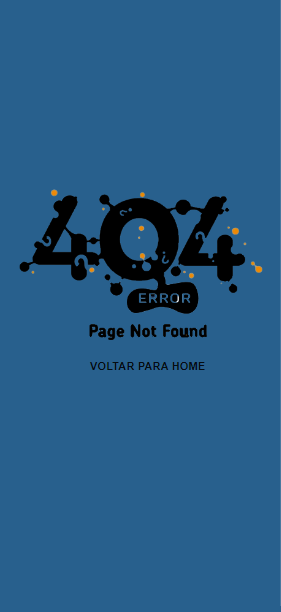

<!--  Animaão -->

   

<h1>
     
    
🧠 Contexto

</h1>

O objetivo foi criar uma página de listagem de filmes.

- 🎯 Objetivo do Projeto
- ✍️ Designer
- ⚙️ Requisitos
- ✨ O que Funciona
- 🔗 Link do Projeto no Surge
- 💻 Como rodar o projeto
- 🎨 Layout
- 🛠️ Tecnologias Utilizadas
- 📚 Bibliotecas Utilizadas
- 👨‍💻 Desenvolvedores

<h1>
     
    
🎯 Objetivo do projeto

</h1>
   

Usando a API de filmes gratuita themoviedb em sua versão 3, você será responsável por criar uma listagem dos filmes mais populares do dia, consultando o endpoint GET /movie/popular para realizar a listagem. Ao clicar em um item dessa listagem, outra página com os detalhes do filme escolhido deve ser exibida. Para acessar mais detalhes sobre o filme, você pode consultar o endpoint GET /movie/{movie_id}.

Para garantir que o usuário encontre o filme que está procurando, essa lista deverá ser paginada.

 

<h1>
     
    
✍️ Designer

</h1>

Siga o layout do figma sugerido: [clicando aqui](https://www.figma.com/file/rM7WPqhLY9ObnGzSCeWLxB/Teste-Front-End?node-id=0%3A1&t=hgH3PD26XRkY35aa-0)

 

<h1>
   
    
⚙️ Requisitos

</h1>

- O usuário deve ter acesso a uma listagem dos filmes mais populares do dia

- O usuário deve conseguir paginar a lista para encontrar novos filmes

- O usuário deve ter acesso a uma outra página com detalhes sobre o filme, ao clicar em um item na listagem

- A página com detalhes de um filme deve possuir uma rota própria e estar preparada para ser indexada em mecanismos de pesquisa

- **Extras**

Temos insights que nos levam a acreditar que os usuários dessa lista costumam ter uma experiência melhor se conseguirem criar um filtro usando seus gêneros favoritos. Portanto, você também poderá criar filtros de filmes por gênero nessa listagem. Note que um novo endpoint deverá ser consultado para obter uma lista dos possíveis gêneros a serem filtrados, GET /genre/movie/list.

- O usuário deve conseguir filtrar os filmes listados por gênero, com a possibilidade de usar mais de um gênero

- O usuário deve conseguir remover filtros e a listagem deve ser atualizada de acordo com o filtro removido

- O usuário deve conseguir voltar para a página de listagem de filmes com os filtros ainda ativos

<h1>
     
    
✨ O que Funciona

</h1>

- Abre a página home ao clicar no TMDB
- Filtros funcionam e mudam de cor
- Paginação
- Abre a página de detalhes do filme ao clicar no card de filmes
- Scroll dos cards de elenco
- Vídeo trailer do youtube
- Abre a página de detalhes do filme ao clicar no card de filmes em recomendações
- Responsivo para mobile

<h1>
     
    
🔗 Link do projeto no Surge

</h1>

https://promobit-movie-tmdb.surge.sh/

<h1>
     
    
💻 Como rodar o projeto localmente

</h1>

Siga os passos e inclua as informações abaixo:

| Passo                     | Comando/informação |
| ------------------------- | ------------------ |
| Faça o fork               | `botão de forkar`  |
| ou Faça o clone           | `git clone`        |
| Instale as dependências   | `npm i`            |
| utilize o script de start | `npm start`        |

E divirta-se ;)

<h1>
     
    
🎨 Layout

</h1>

## 🖥️ web

        

        

        

        

## 📱 Mobile

        
     

      
        

   
      
       

         

 

<h1>
    
🛠️ Tecnologias Utilizadas

</h1>

 
 
 
  
  
  
  
 

 

<h1>
     
    
📚 Bibliotecas utilizadas

</h1>

- [styled-components](https://styled-components.com/)
- [axios](https://github.com/axios/axios)
- [react-icons](https://react-icons.github.io/react-icons)
- [react-router-dom](https://v5.reactrouter.com/)
- [material-ui](https://mui.com/)
- [react-circular-progressbar](https://www.npmjs.com/package/react-circular-progressbar)
- [date-fns](https://www.npmjs.com/package/date-fns)

<h1>
     
    
👨‍💻 Desenvolvedores

</h1>

 <table>

_Caso queira contribuir com o projeto, será totalmente bem-vindx!!!_

_Qualquer dúvida ou sugestão, chama no contatinho!_

  <tr>
    <td align="center"><a href="https://github.com/elisabetealves"> <b>Elisabete Alves</b></a>  </td>     
  </tr>
  
</table>

 

### Feito com 💕 e muita dedicação

 
<h2>
  <a href='#top'>🔝 Voltar para o topo.</a>
</h2>
 
